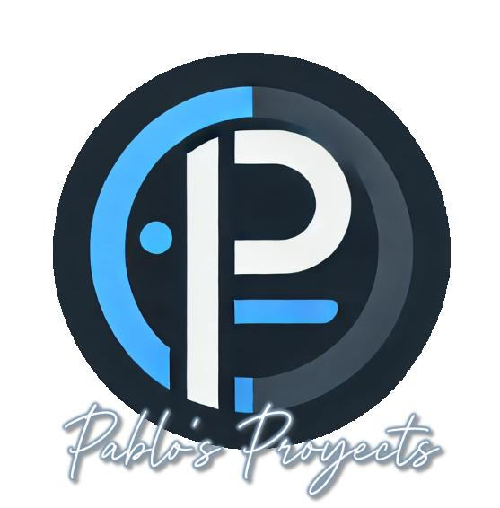

##  Hola a todos! Mi nombre es Pablo 👋
### Estudiante de DAW y desarrollando mi proyecto

<!--
**PabloFernCump/PabloFernCump** is a ✨ _special_ ✨ repository because its `README.md` (this file) appears on your GitHub profile.

Here are some ideas to get you started:

- 🔭 I’m currently working on ...
- 🌱 I’m currently learning ...
- 👯 I’m looking to collaborate on ...
- 🤔 I’m looking for help with ...
- 💬 Ask me about ...
- 📫 How to reach me: ...
- 😄 Pronouns: ...
- ⚡ Fun fact: ...
-->
# 👋 ¡Hola, soy Pablo Fernández!

## 💼 Sobre mí
Soy **Store Manager en Foot Locker**, donde llevo más de **15 años** desarrollando mi carrera profesional.  
Durante este tiempo he tenido la oportunidad de **liderar equipos de entre 10 y 60 personas**, gestionando operaciones, formación y desarrollo de talento.

Mi dedicación y compromiso me han llevado a recibir diversos reconocimientos:
- 🏆 *Líder del Año 2024 España*  
- 🏆 *Manager del Año en Mentalidad Empresarial 2024 España*  
- 🏆 *Manager del Año en Madrid 2024*

Gracias a esta trayectoria, he desarrollado una sólida **capacidad de liderazgo**, **gestión de equipos**, **resolución de problemas** y una fuerte **orientación a resultados** — habilidades que considero clave también en el ámbito tecnológico.

---

## 💻 En formación: Desarrollo de Aplicaciones Web (DAW)
Actualmente estoy cursando el **Ciclo Formativo de Grado Superior en Desarrollo de Aplicaciones Web (DAW)**, habiendo completado con éxito el primer año.  
Mi objetivo es seguir aprendiendo y aplicar los conocimientos adquiridos en proyectos reales, uniendo mi experiencia en gestión con el mundo del desarrollo.

### 🔧 Tecnologías que estoy aprendiendo:
- **Frontend:** HTML5, CSS3, JavaScript  
- **Backend:** PHP, Java  
- **Bases de datos:** MySQL  
- **Entornos de desarrollo:** Visual Studio Code, IntelliJ IDEA, XAMPP  
- **Control de versiones:** Git y GitHub  
- **Principios de desarrollo:** usabilidad, accesibilidad, arquitectura web y buenas prácticas  

---

## 🚀 Objetivo
Combinar mi **experiencia en liderazgo y gestión de personas** con mis **nuevas habilidades técnicas** para crecer profesionalmente en el ámbito del desarrollo web.  
Me apasiona aprender, colaborar en proyectos con propósito y seguir mejorando cada día.

---

### 📫 Conectemos
Si quieres charlar sobre tecnología, desarrollo o liderazgo, ¡me encantará conectar contigo!  

 

 

<!--

-->
