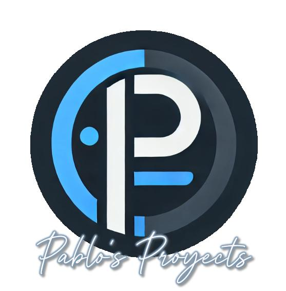
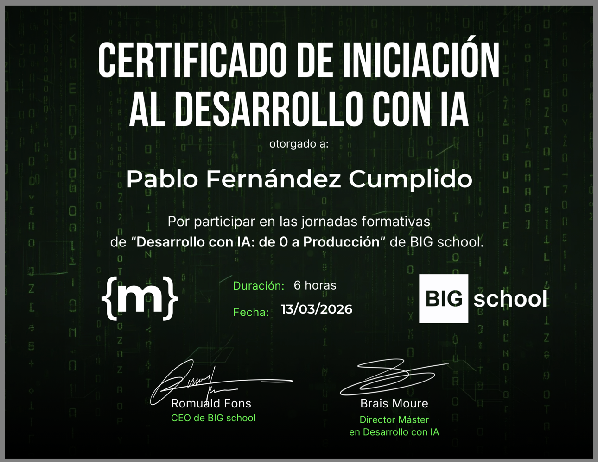

##  Hola a todos! Mi nombre es Pablo 👋
### Estudiante de DAW y desarrollando mi proyecto

# 👋 ¡Hola, soy Pablo Fernández!

## 💼 Sobre mí
Soy **Store Manager en Foot Locker**, donde llevo más de **15 años** desarrollando mi carrera profesional.  
Durante este tiempo he tenido la oportunidad de **liderar equipos de entre 10 y 60 personas**, gestionando operaciones, formación y desarrollo de talento.

Mi dedicación y compromiso me han llevado a recibir diversos reconocimientos:
- 🏆 *Líder del Año 2024 España*  
- 🏆 *Manager del Año en Mentalidad Empresarial 2024 España*  
- 🏆 *Manager del Año en Madrid 2024*

Gracias a esta trayectoria, he desarrollado una sólida **capacidad de liderazgo**, **gestión de equipos**, **resolución de problemas** y una fuerte **orientación a resultados** — habilidades que considero clave también en el ámbito tecnológico.

---

## 💻 En formación: Desarrollo de Aplicaciones Web (DAW)
Actualmente estoy cursando el **Ciclo Formativo de Grado Superior en Desarrollo de Aplicaciones Web (DAW)**, habiendo completado con éxito el primer año.  
Durante mis **prácticas (600 horas)**, me he especializado en el desarrollo web con **WordPress**, creando y programando páginas web desde cero.  
He trabajado especialmente con constructores visuales como **Elementor** y **Divi**, adquiriendo experiencia en diseño, personalización y optimización de sitios web.

Además, he realizado un **curso de desarrollo con Inteligencia Artificial**, ampliando mis conocimientos en nuevas herramientas y enfoques tecnológicos aplicados al desarrollo.

### 🔧 Tecnologías que estoy aprendiendo:
- **Frontend:** HTML5, CSS3, JavaScript, TypeScript, React
- **Backend:** PHP, Java, Node.js
- **CMS:** WordPress (Elementor, Divi)   
- **Bases de datos:** MySQL
- **DevOps / Despliegue:** Docker (docker-compose, entornos Node.js + base de datos)
  🐳 Experiencia creando entornos de desarrollo local dockerizados, levantando servicios con Node.js y bases de datos mediante docker-compose.
- **Entornos de desarrollo:** Visual Studio Code, IntelliJ IDEA, XAMPP  
- **Control de versiones:** Git y GitHub
- **Otros:** Fundamentos de IA aplicada al desarrollo  
- **Principios de desarrollo:** usabilidad, accesibilidad, arquitectura web y buenas prácticas  

---

## 🚀 Objetivo
Combinar mi **experiencia en liderazgo y gestión de personas** con mis **nuevas habilidades técnicas** para crecer profesionalmente en el ámbito del desarrollo web.  
Me apasiona aprender, colaborar en proyectos con propósito y seguir mejorando cada día.

---
## 📜 Certificaciones
### Curso de Desarrollo con Inteligencia Artificial

---

## 📂 Proyectos destacados

### 🎾 Plataforma de reservas deportivas (Padel & Tenis)
Aplicación web full stack para la gestión de reservas en clubes deportivos, desarrollada con **Node.js y TypeScript**.

- 🔧 Tecnologías: Node.js, TypeScript, React, MySQL, Docker, CSS  
- ⚙️ Funcionalidades:
  - Sistema de reservas de pistas  
  - Gestión de usuarios, reservas y pistas 
  - Envío automático de emails transaccionales  
  - Integración de pagos online con Stripe  
  - Generación de eventos añadibles a calendario (iOS / Google Calendar)  
  - Dashboard con métricas y analítica del club

- ⚛️ Frontend desarrollado con React para una experiencia dinámica e interactiva.

- 📩 Notificaciones:
  - Confirmaciones por email  
  - Integración con calendario mediante eventos descargables  

- 💳 Pagos:
  - Integración completa con Stripe para gestión de reservas  

- 📊 Analítica:
  - Visualización de datos clave del negocio mediante dashboard  

- 🐳 DevOps:
  - Entorno dockerizado con **docker-compose** (Node.js + base de datos)
 
📌 Proyecto desarrollado simulando un entorno real de negocio, enfocado en la experiencia de usuario y la gestión operativa de clubes deportivos.

<!-- 🔗 [Ver proyecto](AQUI_TU_LINK) -->

---
### 📫 Conectemos
Si quieres charlar sobre tecnología, desarrollo o liderazgo, ¡me encantará conectar contigo!  

 

 

<!--

-->
